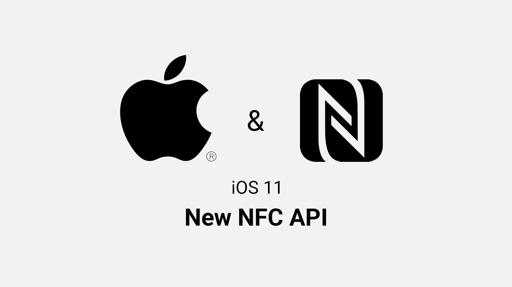
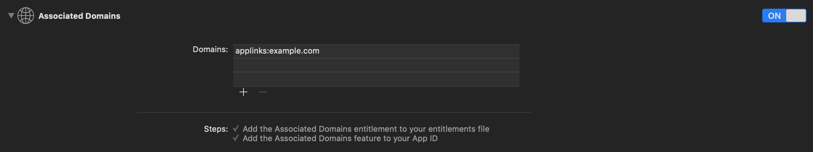

# NFC Background reading with Swift



## Overview

On iPhones that support background tag reading, the system scans for and reads NFC data without requiring users to scan tags using an app. The system displays a pop-up notification each time it reads a new tag. After the user taps the notification, the system delivers the tag data to the appropriate app. If the iPhone is locked, the system prompts the user to unlock the phone before providing the tag data to the app.

>iPhone X and earlier devices don’t support background tag reading.

In order to avoid unintentional tag reading, the system reads tags in the background only when the user's iPhone is in use. Also, be aware there are times when the display is on and background tag reading is unavailable, such as if:
* The device has never been unlocked.
* A Core NFC reader session is in progress.
* Apple Pay Wallet is in use.
* The camera is in use.
* Airplane mode is enabled.

[Link to the apple documentation](https://developer.apple.com/documentation/corenfc/adding_support_for_background_tag_reading "Apple Documentation")

## Instructions

### 1. Set up an Apple App Associated Domain

#### 1.1 Set up the entitlement in your app

1. Open up the project's Capabilities tab and enable `Associated Domains`
2. Click Add (+) at the bottom of the Domains table in order to add a placeholder domain with the `applinks:` prefix. Replace the placeholder with your site’s domain, retaining the prefix.

3. Add the domains with which you want your app to be associated
> To match all subdomains of an associated domain, specify a wildcard with the prefix *. before the beginning of a specific domain.
> Each domain you associated with your app, needs to follow this format:
> `<service>:<fully qualified domain>[:port number]`

#### 1.2 Add the Apple App Site Association file to your website

1. Create a file named `apple-app-site-association` (without an extension).
2. Update the file to contain the JSON representation of a dictionary listing the app identifiers associated with your domain for the webcredentials service.
``` json
{
  "applinks": {
    "apps": [],
    "details": [
    {
      "appID": "D3KQX62K1A.com.example.DemoApp",
      "paths": ["*"]
    }, {
      "appID": "D3KQX62K1A.com.example.DemoAdminApp",
      "paths": ["*"]
    }
    ]
  }
}
 ```
 Use the following format for the app identifiers:
`<Team Identifier>.<Bundle Identifier>`

3. Place the file under your site's root directory
`https://<fully qualified domain>/apple-app-site-association`
> Please remember that you need to host your website on an **https://** site, with a valid certificate!

#### 1.3 Validate your Apple App Site Association file

1. Check if your site contains the `apple-app-site-association` under:
`https://<fully qualified domain>/apple-app-site-association`
2. If your `apple-app-site-association` doesn't exists, please check again if you placed the file at your sites root directory.

> When your app is installed on an iOS device, the system attempts to download and verify the association file from the domains listed in your entitlement. For each domain, iOS appends /apple-app-site-association (or /.well-known/apple-app-site-association) to its name. With this new URL, the system downloads the contents and ensures the file includes the app’s application identifier.

#### 1.4 Validate if your app is associated with your domain

1. Reinstall your app on a physical device
2. Open up a link to your associated domain on your phone:
`https://<fully qualified domain>/`
3. Check if your app opens instead of the url
4. If that doesn't work, go back to **Chapter 1.3**

#### 1.5 Connect the NFC Tag

1. Write the associated domain on your NFC Tag
>You can follow this tutorial if you don't have any experience with NFC Tags:
>[Tutorial: Write NFC Tag](https://blog.atlasrfidstore.com/write-nfc-tag "Write NFC Tag")

#### 1.6 Done

Now you should be able to hold a NFC Tag, with your associated domain written on, on top of your phone and get a notification to open your app.

#### 1.7 Handle Tag Delivery (Addition)

To handle the NDEF message read from the tag, implement the `application(_:continue:restorationHandler:)` method in your app delegate. The system calls this method to deliver the tag data to your app in an ?`NSUserActivity` object. The user activity has an `activityType` of `NSUserActivityTypeBrowsingWeb`, and the tag data is available in the `ndefMessagePayload` property.

For user activities not generated by background tag reading, `ndefMessagePayload` returns a message that contains only one `NFCNDEFPayload` record. That record has a `typeNameFormat` of `NFCTypeNameFormat.empty`.

``` swift
func application(_ application: UIApplication,
                 continue userActivity: NSUserActivity,
                 restorationHandler: @escaping ([Any]?) -> Void) -> Bool {

    guard userActivity.activityType == NSUserActivityTypeBrowsingWeb else {
        return false
    }

    // Confirm that the NSUserActivity object contains a valid NDEF message.
    let ndefMessage = userActivity.ndefMessagePayload
    guard ndefMessage.records.count > 0,
        ndefMessage.records[0].typeNameFormat != .empty else {
            return false
    }

    // Send the message to `MessagesTableViewController` for processing.
    guard let navigationController = window?.rootViewController as? UINavigationController else {
        return false
    }

    navigationController.popToRootViewController(animated: true)
    let messageTableViewController = navigationController.topViewController as? MessagesTableViewController
    messageTableViewController?.addMessage(fromUserActivity: ndefMessage)

    return true
}
```